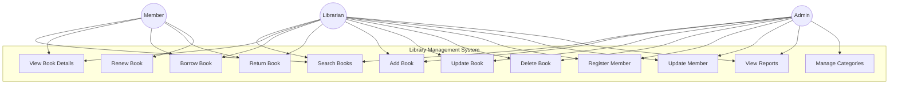
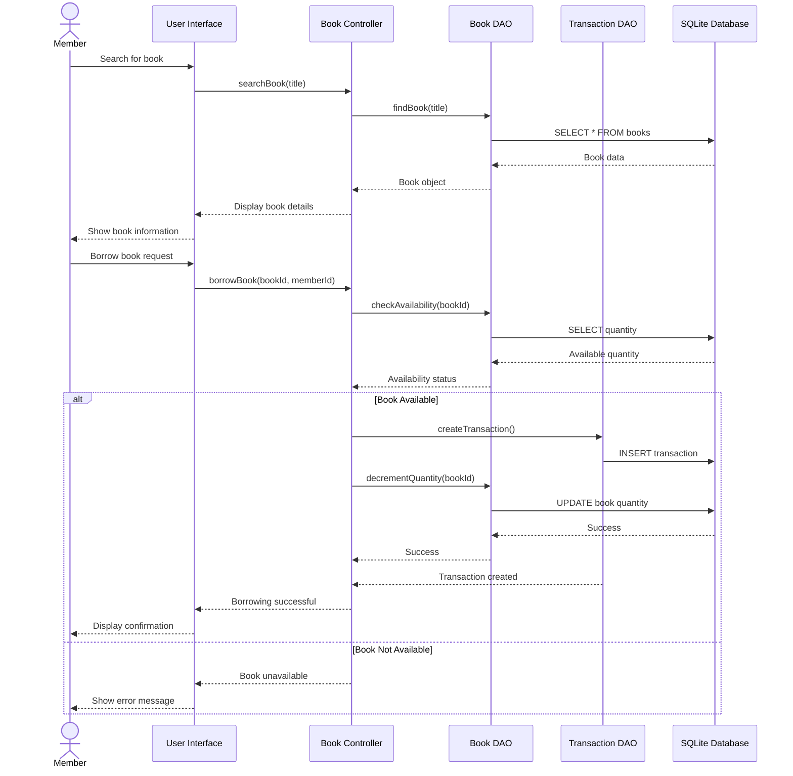
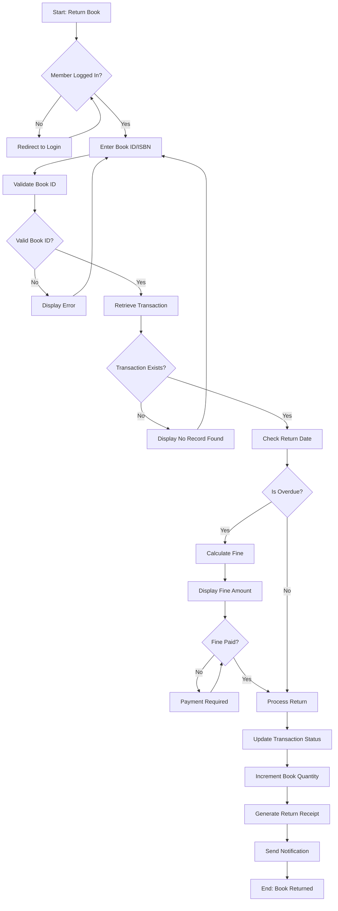
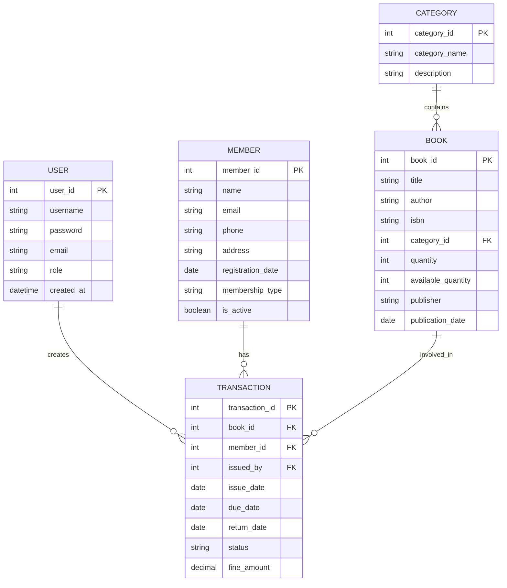
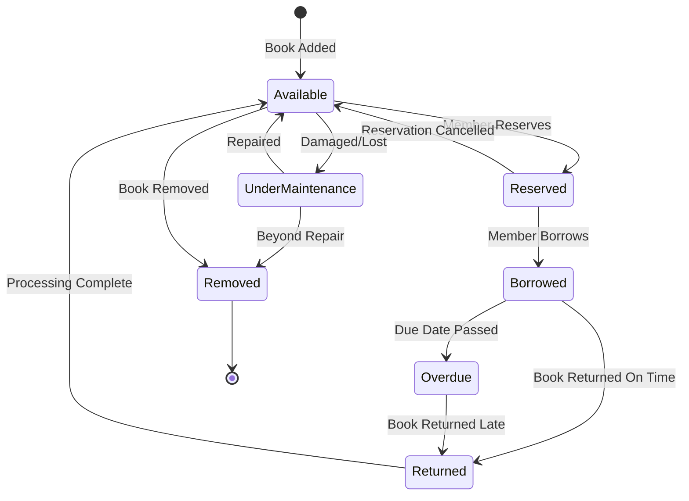

# Library Management System

A comprehensive Library Management System built with Java for Android platform, designed to automate and streamline library operations for efficient management of books, members, and borrowing activities.

## 📋 Table of Contents

- [Overview](#overview)
- [Features](#features)
- [Technology Stack](#technology-stack)
- [Project Structure](#project-structure)
- [System Architecture](#system-architecture)
- [UML Diagrams](#uml-diagrams)
- [Installation](#installation)
- [Usage](#usage)
- [Contributing](#contributing)
- [License](#license)

## 🎯 Overview

The Library Management System is an Android-based application that provides an intuitive interface for managing library resources. It eliminates manual processes and provides real-time information about book availability, member records, and borrowing activities.

### Key Objectives

- Automate library operations and reduce manual effort
- Provide real-time book availability information
- Streamline book borrowing and return processes
- Maintain comprehensive records of books and members
- Generate reports for library analytics

## ✨ Features

### For Librarians/Admins
- **Book Management**
  - Add, update, and remove books from the catalog
  - Categorize books by genre, author, and subject
  - Track book availability status
  - Generate unique book IDs

- **Member Management**
  - Register new members
  - Update member information
  - View member borrowing history
  - Manage member accounts

- **Transaction Management**
  - Issue books to members
  - Process book returns
  - Track overdue books
  - Generate borrowing reports

### For Members/Students
- **Book Search & Discovery**
  - Search books by title, author, ISBN, or category
  - View book details and availability
  - Check personal borrowing history
  - Reserve books

- **Account Management**
  - View profile information
  - Update personal details
  - Track borrowed books and due dates
  - Receive notifications for due dates

## 🛠️ Technology Stack

- **Language**: Java
- **Platform**: Android
- **Build Tool**: Gradle
- **Architecture**: MVC (Model-View-Controller)
- **Database**: SQLite / Room Database (for local storage)

## 📁 Project Structure

```
Library-Management-System/
│
├── app/
│   ├── src/
│   │   ├── main/
│   │   │   ├── java/
│   │   │   │   └── com/library/management/
│   │   │   │       ├── activities/
│   │   │   │       │   ├── MainActivity.java
│   │   │   │       │   ├── LoginActivity.java
│   │   │   │       │   ├── DashboardActivity.java
│   │   │   │       │   ├── BookManagementActivity.java
│   │   │   │       │   └── MemberManagementActivity.java
│   │   │   │       │
│   │   │   │       ├── models/
│   │   │   │       │   ├── Book.java
│   │   │   │       │   ├── Member.java
│   │   │   │       │   ├── Transaction.java
│   │   │   │       │   └── User.java
│   │   │   │       │
│   │   │   │       ├── database/
│   │   │   │       │   ├── DatabaseHelper.java
│   │   │   │       │   ├── BookDao.java
│   │   │   │       │   ├── MemberDao.java
│   │   │   │       │   └── TransactionDao.java
│   │   │   │       │
│   │   │   │       ├── adapters/
│   │   │   │       │   ├── BookListAdapter.java
│   │   │   │       │   ├── MemberListAdapter.java
│   │   │   │       │   └── TransactionListAdapter.java
│   │   │   │       │
│   │   │   │       └── utils/
│   │   │   │           ├── Constants.java
│   │   │   │           ├── ValidationUtils.java
│   │   │   │           └── DateUtils.java
│   │   │   │
│   │   │   ├── res/
│   │   │   │   ├── layout/
│   │   │   │   ├── drawable/
│   │   │   │   ├── values/
│   │   │   │   └── menu/
│   │   │   │
│   │   │   └── AndroidManifest.xml
│   │   │
│   │   └── test/
│   │
│   └── build.gradle
│
├── gradle/
│   └── wrapper/
│
├── .gitignore
├── .gitattributes
├── build.gradle
├── gradle.properties
├── gradlew
├── gradlew.bat
├── settings.gradle.kts
└── README.md
```

## 🏗️ System Architecture

The application follows the **MVC (Model-View-Controller)** architectural pattern:

- **Model**: Data entities (Book, Member, Transaction) and database operations
- **View**: Android Activities and XML layouts for user interface
- **Controller**: Activity classes that handle user interactions and business logic

### Layer Architecture

```
┌─────────────────────────────────────┐
│      Presentation Layer             │
│   (Activities & Fragments)          │
└─────────────────┬───────────────────┘
                  │
┌─────────────────▼───────────────────┐
│      Business Logic Layer           │
│   (Controllers & Services)          │
└─────────────────┬───────────────────┘
                  │
┌─────────────────▼───────────────────┐
│      Data Access Layer              │
│   (DAOs & Repository)               │
└─────────────────┬───────────────────┘
                  │
┌─────────────────▼───────────────────┐
│      Database Layer                 │
│   (SQLite / Room Database)          │
└─────────────────────────────────────┘
```

## 📊 UML Diagrams

### 1. Class Diagram
classDiagram
    class User {
        -int userId
        -String username
        -String password
        -String email
        -String role
        +login()
        +logout()
        +updateProfile()
    }

    class Book {
        -int bookId
        -String title
        -String author
        -String isbn
        -String category
        -int quantity
        -int availableQuantity
        +addBook()
        +updateBook()
        +deleteBook()
        +searchBook()
        +isAvailable()
    }

    class Member {
        -int memberId
        -String name
        -String email
        -String phone
        -String address
        -Date registrationDate
        -String membershipType
        +registerMember()
        +updateMember()
        +deleteMember()
        +viewBorrowingHistory()
    }

    class Transaction {
        -int transactionId
        -int bookId
        -int memberId
        -Date issueDate
        -Date dueDate
        -Date returnDate
        -String status
        -double fine
        +issueBook()
        +returnBook()
        +calculateFine()
        +renewBook()
    }

    class Librarian {
        -int librarianId
        -String name
        -String email
        +manageBooks()
        +manageMembers()
        +viewReports()
        +generateReport()
    }

    class Database {
        -Connection connection
        +connect()
        +disconnect()
        +executeQuery()
        +executeUpdate()
    }

    User <|-- Member
    User <|-- Librarian
    Transaction "0..*" --> "1" Book : borrows
    Transaction "0..*" --> "1" Member : borrowed by
    Librarian "1" --> "0..*" Book : manages
    Librarian "1" --> "0..*" Member : manages
    Database "1" --> "0..*" Book : stores
    Database "1" --> "0..*" Member : stores
    Database "1" --> "0..*" Transaction : stores
```

### 2. Use Case Diagram



### 3. Sequence Diagram - Book Borrowing Process



### 4. Activity Diagram - Book Return Process



### 5. Entity-Relationship Diagram



### 6. State Diagram - Book Status



## 📥 Installation

### Prerequisites

- Android Studio (Arctic Fox or later)
- JDK 8 or higher
- Android SDK (API Level 21 or higher)
- Gradle 7.0+

### Setup Steps

1. **Clone the repository**
   ```bash
   git clone https://github.com/AkshayMadan098/Library-Management-System.git
   cd Library-Management-System
   ```

2. **Open in Android Studio**
   - Launch Android Studio
   - Select "Open an Existing Project"
   - Navigate to the cloned directory
   - Click "OK"

3. **Sync Gradle**
   - Android Studio will automatically start syncing Gradle files
   - Wait for the sync to complete

4. **Configure Database** (if needed)
   - Update database configuration in `DatabaseHelper.java`
   - Modify connection parameters as required

5. **Build the Project**
   ```bash
   ./gradlew build
   ```

6. **Run the Application**
   - Connect an Android device or start an emulator
   - Click the "Run" button in Android Studio
   - Select your device/emulator

## 🚀 Usage

### For Librarians

1. **Login**
   - Open the application
   - Enter librarian credentials
   - Access admin dashboard

2. **Manage Books**
   - Navigate to Book Management
   - Add new books with details
   - Update existing book information
   - Remove books from catalog

3. **Manage Members**
   - Navigate to Member Management
   - Register new members
   - Update member details
   - View borrowing history

4. **Process Transactions**
   - Issue books to members
   - Process book returns
   - Calculate and collect fines
   - Generate reports

### For Members

1. **Login/Register**
   - Create a new account or login
   - Complete profile information

2. **Search Books**
   - Use search functionality
   - Filter by category, author, or title
   - View book availability

3. **Borrow Books**
   - Select available books
   - Confirm borrowing
   - Note the due date

4. **Return Books**
   - Navigate to borrowed books
   - Select book to return
   - Confirm return

---

**Note**: This is an educational project. For production use, consider implementing additional security measures, authentication systems, and backup mechanisms.
